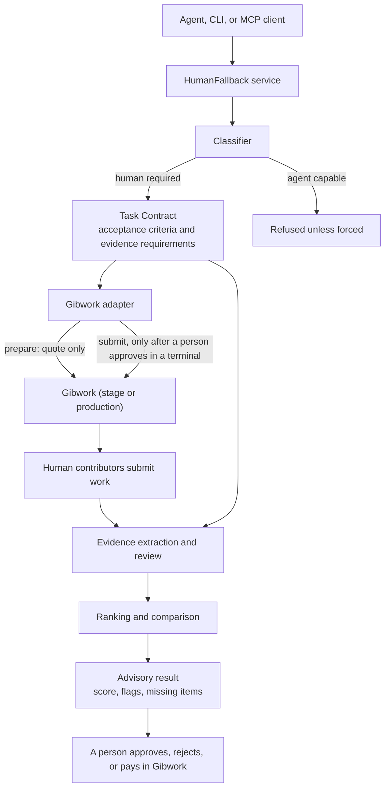

# Architecture

HumanFallback sits between an agent (or a developer at a terminal) and
Gibwork. It decides whether a request needs a person, turns it into a
Task Contract, delegates through Gibwork, and reviews what comes back.
Gibwork holds the escrow, the contributors, and the payout; HumanFallback
never has its own money-moving path.

## Flow



The same service backs both front ends. The CLI presents results and
collects approval; the MCP server presents results and stops there.

## Components

| Component | Module | Role |
|---|---|---|
| Service | `service.py` | Every rule in one place: which states may be delegated or refunded, the uncertain-submit lock, attempt records, one-shot submit |
| Classifier | `classifier/` | Weighted regex rules per category; decides `human_required`, category, confidence, reasons |
| Contract builder | `contracts/` | Category templates, or an explicit spec, into acceptance criteria and evidence requirements |
| Task Contract | `models/contract.py` | Request, classification, reward, criteria, evidence, status, delegation record, attempts |
| Adapters | `adapters/` | `MockGibworkAdapter` for local runs; `GibworkMcpAdapter` speaks MCP over stdio to `gibwork mcp serve` |
| Review | `review/` | Extraction, factual checks, flags, score, recommendation, ranking |
| Store | `store/` | SQLite, one row per contract |
| CLI | `cli.py` | `hf` commands, the only place approval is collected |
| MCP server | `mcp_server.py` | Read and prepare tools for agents |

## Where money can and cannot move

Every financial operation has the same shape:

```
prepare  -> exact quote + one-time confirmation id   (nothing signed)
approve  -> a person reads the quote and says yes    (terminal only)
submit   -> the confirmation is consumed once        (never retried)
```

| Path | classify, contract, review | prepare (quote) | submit, refund | approve, reject, pay |
|---|---|---|---|---|
| `hf` CLI | yes | yes | yes, with `--confirm` and an interactive yes or explicit `--yes` | no |
| HumanFallback MCP | yes | yes, confirmation marked unusable | no tool exists | no tool exists |
| Gibwork CLI / MCP directly | n/a | yes | yes | yes |

Approving, rejecting, and paying a submission is done in Gibwork by a
person, using the scorecards as input. HumanFallback reports; it does not
decide.

## Failure handling on the money path

- Prepared confirmations expire after about five minutes inside the
  Gibwork server process. The confirm path prepares fresh every time.
- If a submit is dispatched and the response is lost (timeout, crash,
  protocol error), the contract enters `submit_uncertain` and every
  further submit is refused until `hf contract reconcile` finds the result
  on Gibwork or a person runs `hf contract resolve` after checking.
- Each prepare/submit cycle is recorded on the contract as an attempt
  with its identifiers, quote, and outcome.
- The Gibwork CLI signs inside its own process from a keypair file it
  resolves itself. HumanFallback never reads, stores, or forwards key
  material and strips `GIBWORK_PRIVATE_KEY` from the child environment.

## Review pipeline

```
submission content + media
  -> extract      URLs, inline  sources, media ids, transaction signatures, prose
  -> evidence     match items to requirements: found / unverified type / constraint failed / missing
  -> criteria     evidence_present, exact_match, pattern checked mechanically; manual left to a person
  -> flags        factual (missing, empty, duplicate) and inferred (relevance, unverified type)
  -> score        100 points, each attributed to a named component with a reason
  -> recommend    reject_candidate / incomplete / needs_human_review / acceptable / strong
  -> rank         by score, missing items, flags, then submission time
```

Optional criteria whose input was not supplied are `not_applicable` and
leave the score entirely. Inferred flags never change the score; they
change the recommendation. See the README for the scoring table.
